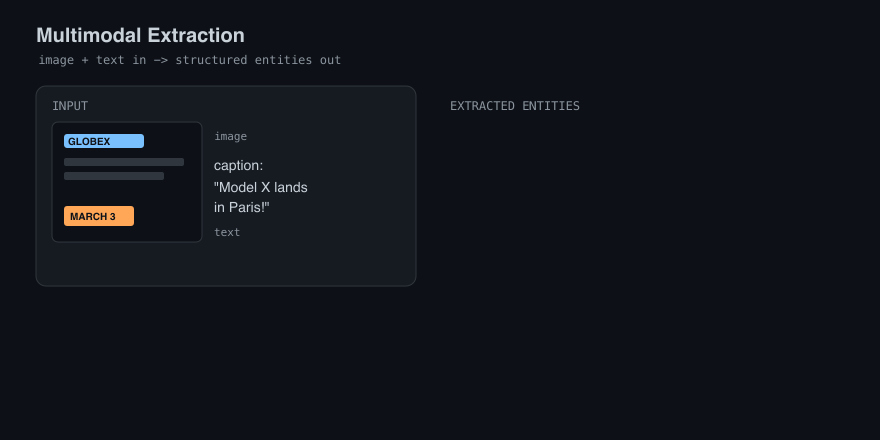
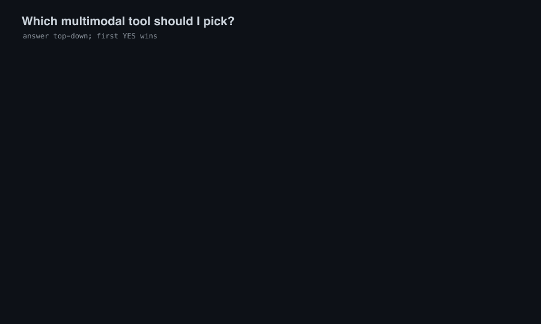

# Awesome Multimodal Extraction 

> A curated, LLM-era list of models, tools, and datasets for extracting entities
> and structured data from images + text: vision-language models, document AI,
> OCR-to-structured pipelines, and multimodal NER.

Text-only extraction is solved enough. The hard, valuable problems now live in
**pixels + words together**: a receipt photo, a chart in a PDF, a tweet with an
image, a scanned form. The old multimodal-NER reading lists stopped at 2023 and
the academic Twitter-image setup; the field has since moved to **vision-language
models** and **document AI**. This list is practitioner-first and kept current,
with every link verified live by CI.

**Not sure where to start?** This picks a tool from your constraints:

## Contents

- [👁️ Vision-Language Models](#-vision-language-models)
- [🤗 VLM Checkpoints (Hugging Face)](#-vlm-checkpoints-hugging-face)
- [📄 Document AI and OCR](#-document-ai-and-ocr)
- [🧩 Structured Extraction from Images](#-structured-extraction-from-images)
- [📐 Layout, Table, and Chart Extraction](#-layout-table-and-chart-extraction)
- [📈 Chart and Diagram Extraction](#-chart-and-diagram-extraction)
- [🎬 Video Extraction](#-video-extraction)
- [🔬 Multimodal NER (Research Lineage)](#-multimodal-ner-research-lineage)
- [📊 Datasets and Benchmarks](#-datasets-and-benchmarks)
- [📏 Evaluation](#-evaluation)
- [📑 Papers](#-papers)
- [📝 Blogs and Notebooks](#-blogs-and-notebooks)
- [🔗 Related Awesome Lists](#-related-awesome-lists)
- [📚 Tutorials and Learning](#-tutorials-and-learning)

## 👁️ Vision-Language Models

Open multimodal LLMs you can prompt to read images and emit structured output.

- [LLaVA](https://github.com/haotian-liu/LLaVA) - The influential open visual-instruction-tuned multimodal LLM.
- [Qwen3-VL](https://github.com/QwenLM/Qwen3-VL) - Alibaba's strong open vision-language model series with document and grounding skills.
- [InternVL](https://github.com/OpenGVLab/InternVL) - High-performing open VLM family competitive with closed models.
- [CogVLM](https://github.com/zai-org/CogVLM) - Powerful open visual-language foundation model.
- [moondream](https://github.com/m87-labs/moondream) - Tiny, fast vision-language model for on-device image understanding.
- [DeepSeek-VL2](https://github.com/deepseek-ai/DeepSeek-VL2) - Mixture-of-experts open VLM strong on documents and charts.
- [MiniCPM-V](https://github.com/OpenBMB/MiniCPM-V) - Efficient on-device multimodal LLM with strong OCR and document skills.
- [GOT-OCR2.0](https://github.com/Ucas-HaoranWei/GOT-OCR2.0) - General OCR theory model that reads documents, formulas, tables, and charts.
- [mPLUG-DocOwl](https://github.com/X-PLUG/mPLUG-DocOwl) - Document-understanding VLM family from Alibaba.

## 🤗 VLM Checkpoints (Hugging Face)

Ready-to-run multimodal checkpoints.

- [🤗 Qwen2.5-VL-7B-Instruct](https://huggingface.co/Qwen/Qwen2.5-VL-7B-Instruct) - Capable open VLM strong at documents, charts, and grounded extraction.
- [🤗 Florence-2-large](https://huggingface.co/microsoft/Florence-2-large) - Microsoft's compact vision foundation model for detection, OCR, and captioning.
- [🤗 idefics2-8b](https://huggingface.co/HuggingFaceM4/idefics2-8b) - Open multimodal model that handles interleaved image-text inputs.
- [🤗 olmOCR-7B](https://huggingface.co/allenai/olmOCR-7B-0225-preview) - AllenAI VLM specialized for high-fidelity document OCR.
- [🤗 Pixtral-12B](https://huggingface.co/mistralai/Pixtral-12B-2409) - Mistral's open multimodal model for image + text understanding.
- [🤗 Phi-3.5-vision](https://huggingface.co/microsoft/Phi-3.5-vision-instruct) - Small, capable multimodal model good at document reasoning.
- [🤗 MiniCPM-V-2.6](https://huggingface.co/openbmb/MiniCPM-V-2_6) - Strong compact VLM with OCR and multi-image support.
- [🤗 SmolVLM](https://huggingface.co/HuggingFaceTB/SmolVLM-Instruct) - Tiny, efficient VLM for image-text extraction.
- [🤗 DeepSeek-VL2](https://huggingface.co/deepseek-ai/deepseek-vl2) - MoE vision-language checkpoint for documents and grounding.
- [🤗 GOT-OCR2.0](https://huggingface.co/stepfun-ai/GOT-OCR2_0) - End-to-end OCR-2.0 model checkpoint.

## 📄 Document AI and OCR

Turn PDFs, scans, and photos into clean, structured text.

- [Docling](https://github.com/docling-project/docling) - Parse PDFs, DOCX, and more into structured, AI-ready document representations.
- [Marker](https://github.com/datalab-to/marker) - Convert PDFs and documents to clean Markdown/JSON with high fidelity.
- [MinerU](https://github.com/opendatalab/MinerU) - Extract high-quality structured content from PDFs, including formulas and tables.
- [Unstructured](https://github.com/Unstructured-IO/unstructured) - Pre-processing that extracts text and elements from many document types.
- [Surya](https://github.com/datalab-to/surya) - OCR, layout, reading-order, and table detection across 90+ languages.
- [Nougat](https://github.com/facebookresearch/nougat) - Transformer that converts scientific PDFs (incl. math) to markup.
- [docTR](https://github.com/mindee/doctr) - End-to-end OCR with deep-learning detection and recognition.
- [PaddleOCR](https://github.com/PaddlePaddle/PaddleOCR) - Multilingual, production-grade OCR toolkit.
- [EasyOCR](https://github.com/JaidedAI/EasyOCR) - Ready-to-use OCR for 80+ languages.
- [Tesseract](https://github.com/tesseract-ocr/tesseract) - The classic open-source OCR engine.
- [MarkItDown](https://github.com/microsoft/markitdown) - Microsoft tool that converts Office files, PDFs, and images to Markdown for LLMs.
- [olmOCR](https://github.com/allenai/olmocr) - AllenAI toolkit for high-throughput, high-fidelity document OCR with a VLM.
- [Pix2Text](https://github.com/breezedeus/Pix2Text) - Extract text, formulas, and tables from images (a free Mathpix alternative).
- [Jina Reader](https://github.com/jina-ai/reader) - Convert any URL or PDF into clean, LLM-ready text.

## 🧩 Structured Extraction from Images

Go straight from an image to typed fields and JSON.

- [Zerox](https://github.com/getomni-ai/zerox) - OCR-then-LLM pipeline that turns documents and images into structured data.
- [Instructor](https://github.com/567-labs/instructor) - Typed, schema-validated LLM outputs; supports vision models for image extraction.
- [BAML](https://github.com/BoundaryML/baml) - A language for typed LLM functions, including image inputs for extraction.
- [Donut](https://github.com/clovaai/donut) - OCR-free document understanding transformer for parsing and extraction.
- [Sparrow](https://github.com/katanaml/sparrow) - Data extraction from documents and images with VLMs and a rule engine.
- [OmniParse](https://github.com/adithya-s-k/omniparse) - Ingest and parse any document type into structured, LLM-ready data.
- [OmniParser](https://github.com/microsoft/OmniParser) - Microsoft tool that parses UI screenshots into structured elements.

## 📐 Layout, Table, and Chart Extraction

Recover structure, not just text.

- [Table Transformer](https://github.com/microsoft/table-transformer) - Detect tables and their structure in documents.
- [LayoutParser](https://github.com/Layout-Parser/layout-parser) - Deep-learning toolkit for document image layout analysis.
- [LayoutLM (unilm)](https://github.com/microsoft/unilm) - Home of LayoutLM/LayoutLMv3 for document layout understanding and extraction.

## 📈 Chart and Diagram Extraction

Turn charts and plots back into the underlying data.

- [🤗 DePlot](https://huggingface.co/google/deplot) - One-shot chart-image-to-data-table model from Google.
- [🤗 MatCha](https://huggingface.co/google/matcha-base) - Chart and plot understanding pretrained model.
- [UniChart](https://github.com/vis-nlp/UniChart) - Universal chart understanding and reasoning model.
- [🤗 UniChart-ChartQA](https://huggingface.co/ahmed-masry/unichart-chartqa-960) - UniChart checkpoint fine-tuned for chart question answering.
- [ChartQA](https://github.com/vis-nlp/ChartQA) - Benchmark and code for question answering over charts.

## 🎬 Video Extraction

Extract entities, events, and structured info from video.

- [Video-LLaVA](https://github.com/PKU-YuanGroup/Video-LLaVA) - Unified video-and-image language model for understanding and extraction.
- [Video-LLaMA](https://github.com/DAMO-NLP-SG/Video-LLaMA) - Audio-visual language model for video understanding.
- [VideoChat (Ask-Anything)](https://github.com/OpenGVLab/Ask-Anything) - Chat-centric video understanding and question answering.
- [InternVideo](https://github.com/OpenGVLab/InternVideo) - Video foundation models for recognition and multimodal tasks.
- [🤗 LLaVA-NeXT-Video](https://huggingface.co/llava-hf/LLaVA-NeXT-Video-7B-hf) - Open video-language checkpoint for video QA and extraction.
- [WhisperX](https://github.com/m-bain/whisperX) - Fast speech transcription with word-level timestamps for audio tracks.

## 🔬 Multimodal NER (Research Lineage)

The academic line this list grew from: entity extraction from image-text pairs.

- [UMT](https://github.com/jefferyYu/UMT) - Unified multimodal transformer for NER in social media (ACL 2020).
- [RpBERT](https://github.com/Multimodal-NER/RpBERT) - Text-image relation-propagation BERT for multimodal NER (AAAI 2021).
- [multimodal_NER](https://github.com/RiTUAL-MBZUAI/multimodal_NER) - Study of the role of images for multimodal NER (EMNLP 2021).
- [MAF](https://github.com/xubodhu/MAF) - Matching-and-alignment framework for multimodal NER (WSDM 2022).
- [HVPNeT](https://github.com/zjunlp/HVPNeT) - Hierarchical visual prefix for multimodal entity and relation extraction (NAACL 2022).
- [MKGformer](https://github.com/zjunlp/MKGformer) - Hybrid transformer for multimodal knowledge-graph completion (SIGIR 2022).
- [KB-NER / ITA](https://github.com/Alibaba-NLP/KB-NER) - Image-text alignments for multimodal NER (NAACL 2022).
- [AdaSeq](https://github.com/modelscope/AdaSeq) - Sequence-understanding library including multimodal and retrieval-augmented NER.

## 📊 Datasets and Benchmarks

- [🤗 CORD-v2](https://huggingface.co/datasets/naver-clova-ix/cord-v2) - Receipt parsing dataset for structured document extraction.
- [🤗 FUNSD](https://huggingface.co/datasets/nielsr/funsd-layoutlmv3) - Form understanding in noisy scanned documents.
- [🤗 DocVQA](https://huggingface.co/datasets/lmms-lab/DocVQA) - Question answering over document images.
- [🤗 ChartQA](https://huggingface.co/datasets/HuggingFaceM4/ChartQA) - Question answering and extraction over charts.

## 📏 Evaluation

- [seqeval](https://github.com/chakki-works/seqeval) - Entity-level F1 evaluation for sequence labeling.
- [nervaluate](https://github.com/MantisAI/nervaluate) - Nuanced NER evaluation (partial, exact, type) following SemEval.

## 📑 Papers

Foundational and current reading (Hugging Face Papers pages link to PDF + code).

- [LLaVA](https://huggingface.co/papers/2304.08485) - Visual instruction tuning; the open multimodal-LLM blueprint.
- [Qwen2-VL](https://huggingface.co/papers/2409.12191) - Dynamic-resolution VLM with strong document and grounding ability.
- [Qwen2.5-VL](https://huggingface.co/papers/2502.13923) - Technical report for the Qwen2.5-VL series.
- [Florence-2](https://huggingface.co/papers/2311.06242) - Unified vision foundation model for detection, OCR, and grounding.
- [Donut](https://huggingface.co/papers/2111.15664) - OCR-free document understanding transformer.
- [LayoutLMv3](https://huggingface.co/papers/2204.08387) - Unified text-and-image masking for document AI.
- [Nougat](https://huggingface.co/papers/2308.13418) - Neural optical understanding for academic documents.
- [GOT-OCR2.0](https://huggingface.co/papers/2409.01704) - General OCR theory toward a unified end-to-end model.
- [MLLM Survey](https://huggingface.co/papers/2306.13549) - A survey on multimodal large language models.

## 📝 Blogs and Notebooks

Hands-on walkthroughs and runnable notebooks.

- [HF: Document AI](https://huggingface.co/blog/document-ai) - Overview of document-AI models and how to use them.
- [HF: IDEFICS2](https://huggingface.co/blog/idefics2) - Building and using an open multimodal model.
- [HF: SmolVLM](https://huggingface.co/blog/smolvlm) - A small, efficient VLM and how to apply it.
- [roboflow/notebooks](https://github.com/roboflow/notebooks) - Notebooks for VLMs, Florence-2, and vision models.
- [Gemini Cookbook](https://github.com/google-gemini/cookbook) - Official recipes including multimodal extraction with Gemini.

## 🔗 Related Awesome Lists

- [Awesome Entity Extraction](https://github.com/shivamnegi92/awesome-entity-extraction) - The text-only sibling: NER, relation, and structured extraction.
- [Awesome VLM Architectures](https://github.com/gokayfem/awesome-vlm-architectures) - Deep dive on vision-language model architectures.

## 📚 Tutorials and Learning

- [Transformers Tutorials](https://github.com/NielsRogge/Transformers-Tutorials) - Hands-on notebooks for Donut, LayoutLM, Florence-2, and more.
- [Runnable examples](https://github.com/shivamnegi92/awesome-multimodal-extraction/tree/main/examples) - Copy-paste starting points for VLM and document extraction (in this repo).

## Contributing

Contributions are welcome! Please read [CONTRIBUTING.md](CONTRIBUTING.md) first.
The one hard rule: every entry must link to a real, maintained project and
include a short, factual description. No dead links, no vaporware.

To the extent possible under law, the contributors have waived all copyright and
related or neighboring rights to this work.
